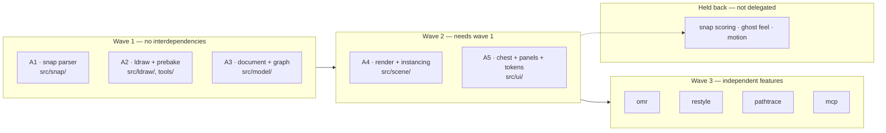
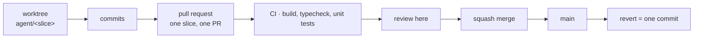

# Agent decomposition

How parallel work is divided, isolated, and verified. Every slice owns a disjoint set of files and
builds against contracts it does not change.

## Prerequisite: contracts are executable

Before any agent starts, the interfaces in [`ARCHITECTURE.md`](ARCHITECTURE.md) are committed as
type-only source files — `src/snap/types.ts`, `src/model/types.ts`, `src/ldraw/types.ts`,
`src/workers/protocol.ts`. Declarations only, no implementations.

Agents import from these. Nobody edits them. A slice that believes a contract is wrong stops and
raises it rather than adapting locally, because a divergent contract is invisible until integration
and expensive at that point.

## Waves



| Slice | Owns | Port | Depends on |
| --- | --- | --- | --- |
| A1 snap parser | `src/snap/**` except `resolve.ts` | 5174 | contracts |
| A2 ldraw + prebake | `src/ldraw/**`, `tools/**` | 5175 | contracts |
| A3 document + graph | `src/model/**` | 5176 | contracts |
| A4 render | `src/scene/**` except `interaction/**` | 5177 | A1, A2, A3 |
| A5 UI + tokens | `src/ui/**`, `src/styles/**` | 5178 | A3 |
| A6–A9 features | `src/features/<name>/**` | 5180+ | A1–A5 |

**Held back deliberately:** `src/snap/resolve.ts` (candidate scoring) and `src/scene/interaction/**`
(ghost behaviour, motion, feel). Agents can verify that these compile and pass tests; they cannot
judge whether a snap lands where a person meant. That judgement is the product, and it stays with us.

## Isolation

Each slice runs in its own git worktree on branch `agent/<slice>`, with an assigned `PORT` so several
dev servers coexist:

```bash
PORT=5174 npm run dev
```

Ports are fixed per slice so two agents never collide on a socket.

## Definition of done

A slice is complete when all of the following hold, verified by the agent itself:

1. `npm run build` succeeds with no TypeScript errors.
2. `npm run test` passes, including new tests for the slice.
3. New pure logic has unit tests, and any parser work has fixture tests against captured real data
   per [`TEST-PLAN.md`](TEST-PLAN.md).
4. No file outside the slice's ownership is modified.
5. No contract file is modified.
6. A short report: what was built, what was tested, what was assumed, what was left undone.

## Verification, honestly scoped

Wave 1 slices are pure modules with no user interface. Requiring them to open a browser would be
theatre; they verify through tests and the build.

Wave 2 and 3 slices produce something visible, and do verify in a browser: start the dev server on
the assigned port, load the page, exercise the feature, screenshot it, and confirm the console is
clean. That catches asset-path errors, worker failures, and render breakage that unit tests cannot.

No agent judges interaction quality. An agent reporting that something "feels good" is reporting
nothing; the report should say what it built and what it measured.

## Merging

Every slice lands through a pull request. `main` stays deployable, and any single slice can be
reverted without unpicking others.



Rules:

- **One slice, one PR.** A PR that touches two slices is split before review.
- **CI is the gate.** `.github/workflows/ci.yml` runs typecheck, build, and unit tests on every PR.
  Red CI is not reviewed.
- **Squash merge**, so each slice is a single revertible commit on `main`.
- **Rebase, don't merge, to update a branch.** Keeps history linear and reverts clean.
- The PR description states what was built, what was tested, what was assumed, and what was left
  undone — the same content as the slice report.

As implementation complexity grows this matters more, not less: the cost of a bad merge is measured
in debugging time, and a revertible unit of work caps that cost.

## Escalation

Agents verify what they can measure. When a slice hits a question it cannot answer by measurement —
does this read correctly, is this the right affordance, which of two behaviours is wanted — it does
not guess and it does not stall. It records the question in its report, with a screenshot where the
question is visual, and hands it back.

Agent reports are not surfaced directly, so escalations are relayed here and answered with human
judgement before the slice continues. A question with a screenshot and two named options gets
answered in seconds; a slice that guessed silently costs a review cycle to discover.

## Agent-to-agent communication

Technically available, and deliberately not used. Slices communicate through contracts and through
escalation, not with each other.

Two agents negotiating an interface between themselves produces an agreement nobody else can see, and
it is precisely the shared types — the things a divergent agreement would quietly bend — that
everything depends on. If a slice needs something from another slice, the contract is either wrong or
incomplete, and that is a decision to make once, centrally, and propagate.

## Conflict policy

Ownership is exclusive. If a slice needs a change in another slice's files, it stops and raises the
conflict rather than making the edit. Parallelism is only cheaper than sequential work while the
merges stay trivial.
