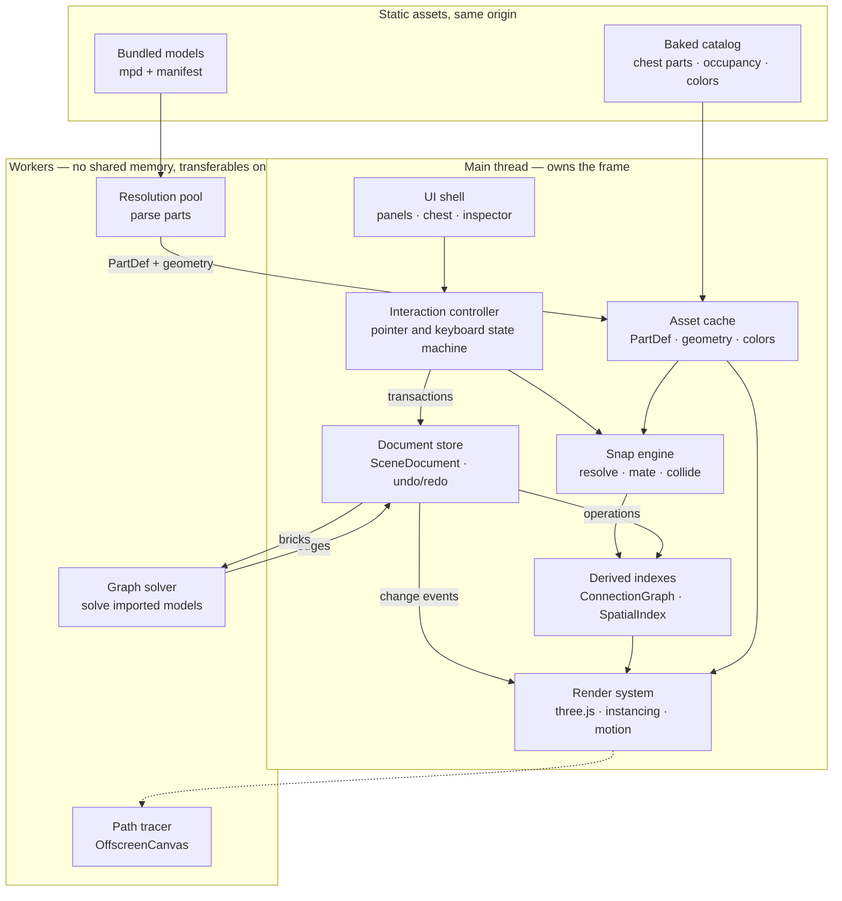
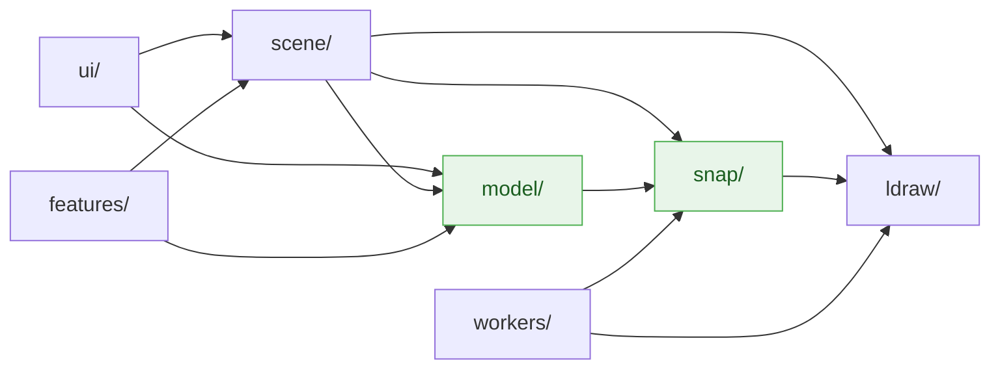
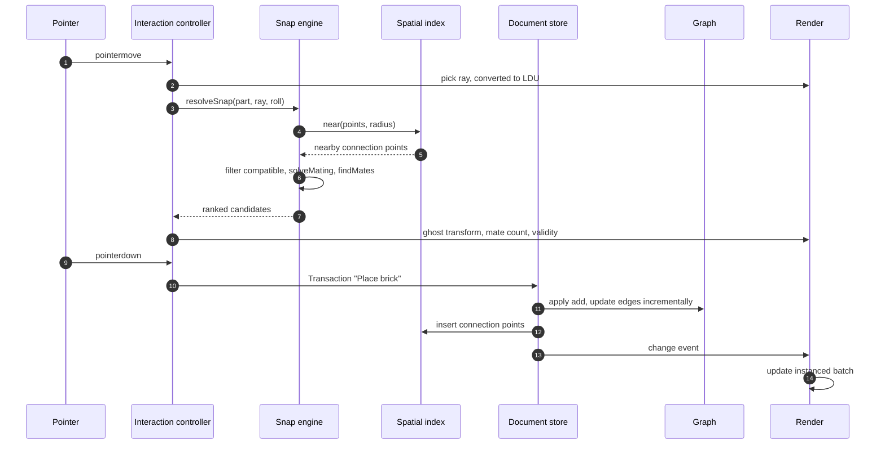
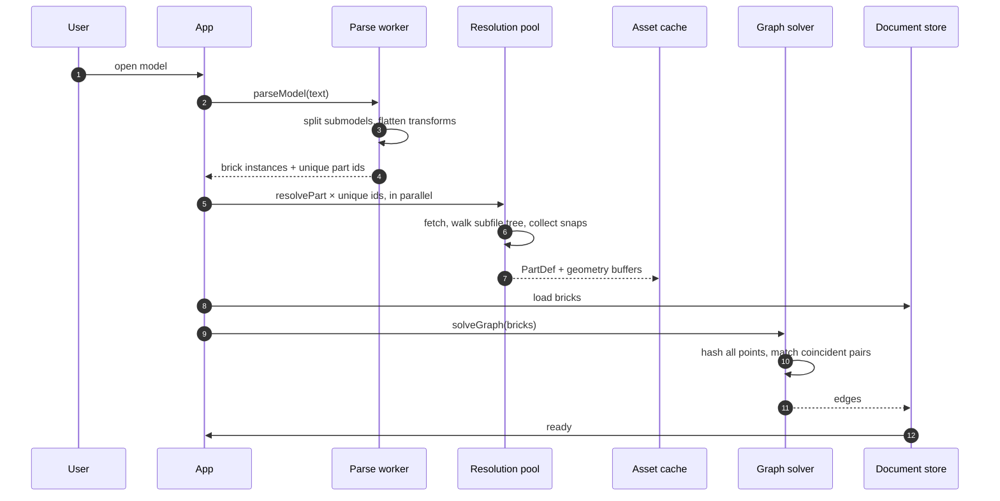
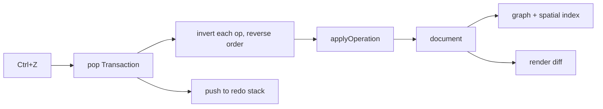
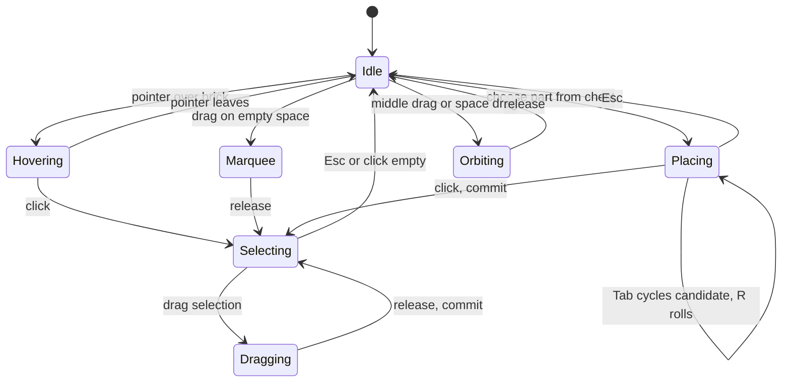
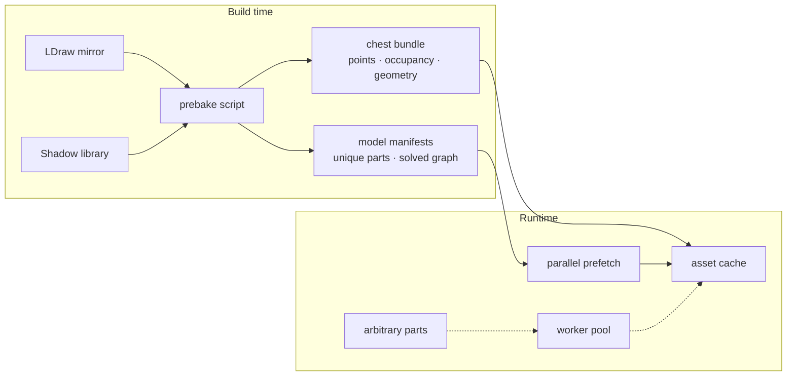
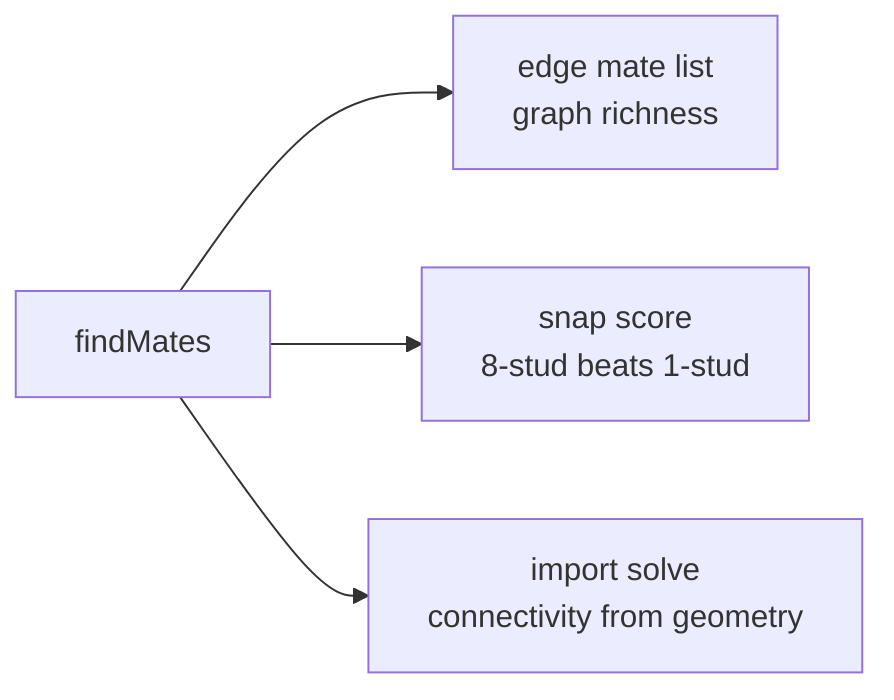
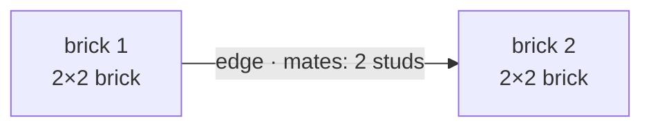

# Architecture

How the application is put together at runtime, followed by the type contracts every module builds
against. Treat the contracts as frozen: changing one is a deliberate, announced act, because parallel
work depends on their stability.

Background on the two file formats is in [`LDRAW-PRIMER.md`](LDRAW-PRIMER.md).

---

# Part 1 — The running system

## What the app is doing

At any moment the app is maintaining four things at once: a **document** of bricks, two **derived
indexes** over it that make spatial questions cheap, a **render tree** that projects it, and a set of
**asynchronous resolvers** filling in part data as it is needed. Every user gesture is a read of the
indexes followed by a transaction against the document; everything else is a consequence.

## Systems

| System | Thread | Owns | Lifetime |
| --- | --- | --- | --- |
| UI shell | main | React panels, chest, inspector, mode chrome | app |
| Interaction controller | main | pointer/keyboard state machine, current gesture | app |
| Document store | main | `SceneDocument`, undo/redo stacks | app |
| Derived indexes | main | `ConnectionGraph`, `SpatialIndex` | rebuilt from document |
| Snap engine | main | candidate resolution, mating, collision | stateless |
| Render system | main | three.js scene, instanced batches, camera, motion, frame loop | app |
| Asset cache | main | `PartDef` and geometry, in-flight dedupe | app |
| Resolution pool | worker ×N | fetch and parse parts into `PartDef` + geometry | app |
| Graph solver | worker ×1 | connection graph for an imported model | per import |
| Path tracer | worker ×1 | progressive GPU render via `OffscreenCanvas` | on demand |



The document is the only writable state. Indexes and the render tree are projections of it and are
never edited directly — that invariant is what keeps undo, snapping, and rendering from disagreeing.

## Module dependencies



`snap/` and `model/` (green) are **pure**: no three.js imports, no DOM access. Nothing depends on
`scene/`. That purity is what makes them unit-testable, and it is also what lets any of them move
behind the worker boundary later without a rewrite.

## Threading, and where it goes next

Two worker systems exist today because their workloads differ: the resolution pool is
network-bound and embarrassingly parallel, while the graph solver is one long job over shared state
that would cost more in transfer than it saves if split.

We expect to push more across the boundary as models get large. The likely candidates, in the order
they will probably start hurting: collision sweeps over big selections, restyle across a whole model,
occupancy mask generation, incremental graph rebuilds after bulk edits, and `.ldr` export. Each is
already pure, so migration is a message-passing change rather than a redesign.

GitHub Pages cannot set COOP/COEP headers, so the page is not cross-origin isolated and
`SharedArrayBuffer` is unavailable. All worker traffic is `postMessage` with transferable typed
arrays.

## Flow: placing a brick

The hot path. Everything here is synchronous and inside the frame budget.



Candidate lookup is a uniform spatial hash with 20 LDU cells, so `near` touches a handful of buckets
regardless of model size. Nothing on this path fetches or parses.

## Flow: opening a model

The cold path. Asynchronous, progress-reported, and never blocking the frame.



A published model of ~50 unique parts costs roughly 1,000 fetches to resolve cold, which is why
bundled models ship with a part manifest: discovery becomes one parallel prefetch instead of a serial
dependency chain.

## Flow: undo



Operations carry both sides of every change, so inversion never consults document state.

## Interaction states



Selection and visibility are view state. They live outside the document and are not undoable.

## Performance budget

| Work | Budget | Where |
| --- | --- | --- |
| Snap resolution per pointer move | < 2 ms | main |
| Frame | 16.7 ms | main |
| Part resolution, cached | < 1 ms | main |
| Part resolution, cold | seconds, async | pool |
| Model import | async with progress | worker + pool |
| Graph solve, whole model | async | solver |

Only the first two are frame-critical. Everything else reports progress and is allowed to take as
long as it needs, which is why aggressive baking matters more than micro-optimisation.

---

# Part 2 — Contracts

## Coordinates

**We are LDraw-native throughout.** Units are LDU and +Y points down, everywhere in `snap/`,
`model/`, and the wire formats. The only conversion is a single `rotation.x = π` on the three.js
scene root, and the matching inverse applied to picking rays as they enter the model layer.

Four of our five data boundaries — the parts library, the shadow library, imported models, and
exported `.ldr` — are LDraw-native. Converting at each would multiply the places a sign error can
hide. One convention and one documented flip is the smaller risk.

```ts
type Vec3 = readonly [number, number, number];
/** Column-major, identical in layout to three.js `Matrix4.elements`. */
type Mat4 = readonly number[]; // length 16
/** Column-major 3×3 orientation basis. */
type Mat3 = readonly number[]; // length 9
```

**Transforms are flat and absolute.** Every brick stores a world matrix; groups are *sets*, not
transform parents. Nested transforms would force every spatial query to walk ancestors, and spatial
queries are the hot path. Moving a group instead writes N matrices, stored compactly as a single
delta (see `transformMany`).

This is also what makes rotated assemblies work without special handling: a brick sitting at 30° has
its connection points at 30° in world space, so snapping onto it uses exactly the same code path as
snapping onto an axis-aligned brick.

## Connection points

Derived from the shadow library during parsing. Immutable, part-local, computed once per part.

```ts
type SnapKind = 'cyl' | 'clip' | 'finger' | 'general';
type Gender = 'M' | 'F';
/** Round, Square, or Axle cross-section. */
type SectionVariant = 'R' | 'S' | 'A';

interface Section {
  variant: SectionVariant;
  radius: number;   // LDU
  length: number;   // LDU
}

interface ConnectionPoint {
  /** Stable within a part, derived from provenance + ordinal. */
  id: string;
  kind: SnapKind;
  gender: Gender;
  /** Profile along the axis. Length > 1 for stepped holes (e.g. Technic pin holes). */
  sections: Section[];
  position: Vec3;
  /** Part-local basis. The connector axis is local +Y. */
  orientation: Mat3;
  /** Connection permits sliding along its axis (Technic pins, bars). */
  slide: boolean;
  /** SNAP_GEN matching group; only meaningful when kind === 'general'. */
  group?: string;
  /**
   * Precomputed compatibility key: kind, gender, variant and bucketed radius packed
   * into one integer, so `isCompatible` is a table lookup rather than a comparison chain.
   */
  key: number;
  /** Source file, for debugging: 'p/stud.dat', 'parts/s/3001s01.dat'. */
  source: string;
}
```

Three properties of the real data drive this shape, all verified against the corpus:

- Orientation is a **full basis**, not an axis enum — minifig joints sit at 45°, SNOT studs point
  along ±X/±Z, and published models place submodels at arbitrary angles.
- `sections` is an **array** — Technic pin holes are stepped (`R 8 2 · R 6 16 · R 8 2`).
- A single primitive can emit **both genders** (`p/stud2.dat`, the open stud), so points are keyed by
  provenance rather than by part face.

## Parts and baking

```ts
interface PartDef {
  id: string;               // '3001'
  title: string;            // 'Brick  2 x  4'
  connections: readonly ConnectionPoint[];
  bounds: { min: Vec3; max: Vec3 };
  /** Coarse occupancy mask for collision, 4 LDU cells, part-local. */
  occupancy: { dims: readonly [number, number, number]; bits: Uint8Array };
  category?: string;
}
```

Cold-resolving one part costs ~20 network fetches and several seconds, and a small published model
uses ~53 unique parts. Baking is therefore not an optimisation, it is the load path.



Serving from our own origin is also strictly faster than the third-party mirror: same-origin, HTTP/2
multiplexed, CDN-backed, and not subject to another host's rate limits.

## Compatibility and mating

```ts
/** Table lookup on precomputed keys. */
function isCompatible(a: ConnectionPoint, b: ConnectionPoint): boolean;

/**
 * World transform placing `movingPart` so its `movingPoint` mates `targetPoint`.
 * `roll` rotates about the shared axis, in quarter turns.
 */
function solveMating(
  movingPart: PartDef,
  movingPoint: ConnectionPoint,
  targetPoint: ConnectionPoint,
  targetWorld: Mat4,
  roll: number,
): Mat4;

/**
 * Every point pair that coincides once `transform` is applied — a 2×4 laid squarely on
 * another 2×4 mates eight studs, not one.
 */
function findMates(
  movingPart: PartDef, transform: Mat4, index: SpatialIndex,
): readonly Mate[];
```

Compatibility is **profile matching**, not merely kind and gender: opposite genders, compatible
section variants, radii equal within tolerance. A round stud mates a square socket of equal radius;
an axle does not fit a round hole.

**Mating is multipoint.** One pair plus a roll determines the transform; `findMates` then reports
every other pair that coincides under it. That single function serves three purposes:



The score is a physical fact rather than an invented heuristic, which is why it disambiguates well.

## Collision

Distinct from mating, and only ever the active piece against the scene.

```ts
function collides(
  part: PartDef, transform: Mat4, index: SpatialIndex, ignore?: ReadonlySet<BrickId>,
): boolean;
```

Broad phase uses brick bounds from the same spatial hash; narrow phase tests the baked 4 LDU
occupancy masks. Bricks appear and disappear constantly, so the structure is a hash grid supporting
O(1) insert and remove, never a precomputed static tree.

## Scene document

```ts
type BrickId = string;
type GroupId = string;

interface BrickInstance {
  id: BrickId;
  partId: string;
  colorCode: number;    // LDraw color code, per LDConfig
  transform: Mat4;      // world, LDU
  groupId?: GroupId;
}

interface GroupDef {
  id: GroupId;
  name: string;
  parentId?: GroupId;
}

interface SceneDocument {
  bricks: ReadonlyMap<BrickId, BrickInstance>;
  groups: ReadonlyMap<GroupId, GroupDef>;
  /** Materialised, and maintained incrementally by `applyOperation`. */
  graph: ConnectionGraph;
}
```

The graph lives in the document rather than being recomputed on demand: it is read constantly, it is
expensive to solve from scratch, and for an imported model it must be solved once up front anyway.

## Connection graph

```ts
type EdgeId = string;

interface Mate {
  aPoint: string;         // ConnectionPoint id on brick a
  bPoint: string;         // ConnectionPoint id on brick b
  kind: SnapKind;
  /** Which side carries the male half. Hinge fingers are genuinely symmetric. */
  polarity: 'a' | 'b' | 'symmetric';
}

interface ConnectionEdge {
  id: EdgeId;
  a: BrickId;
  b: BrickId;
  /** Every point pair joining these two bricks. */
  mates: readonly Mate[];
}

interface GraphNode {
  brick: BrickId;
  /** Edges where this brick carries the male half — what it supports. */
  out: readonly EdgeId[];
  /** Edges where it carries the female half — what supports it. */
  in: readonly EdgeId[];
  /** Symmetric and ungendered connections. */
  peer: readonly EdgeId[];
}

interface ConnectionGraph {
  nodes: ReadonlyMap<BrickId, GraphNode>;
  edges: ReadonlyMap<EdgeId, ConnectionEdge>;
  neighbors(id: BrickId): readonly BrickId[];
  component(id: BrickId): ReadonlySet<BrickId>;
}
```

Two staggered 2×2 bricks share **one** edge carrying **two** mates:



One edge per brick pair; adjacency stored per node in both directions rather than derived by scanning
an edge list. The graph is queried on every hover, selection, and structural operation, so the memory
cost buys back far more in query time. Directionality is what makes "what is holding this up"
answerable; `peer` exists because hinge fingers and some general connections have no male side.

Importing a model solves the graph geometrically via `findMates`. `0 STEP` metadata gives build
order, which is orthogonal to connectivity and is retained for future instruction playback.

## Operations and undo

Every mutation is invertible and carries both sides, so inversion never consults document state.

```ts
type Operation =
  | { type: 'add';       bricks: readonly BrickInstance[] }
  | { type: 'remove';    bricks: readonly BrickInstance[] }
  /** One delta applied to many bricks — multi-select drags and group moves alike. */
  | { type: 'transformMany'; ids: readonly BrickId[]; delta: Mat4 }
  /** Per-brick absolute transforms, for operations that are not a rigid delta. */
  | { type: 'transform'; changes: readonly { id: BrickId; from: Mat4; to: Mat4 }[] }
  | { type: 'recolor';   changes: readonly { id: BrickId; from: number; to: number }[] }
  | { type: 'reparent';  changes: readonly { id: BrickId; from?: GroupId; to?: GroupId }[] }
  | { type: 'addGroup';    group: GroupDef }
  | { type: 'removeGroup'; group: GroupDef };

/** A single user-visible undo step; one gesture may produce several operations. */
interface Transaction {
  label: string;          // 'Rotate assembly', 'Paste 24 bricks'
  ops: readonly Operation[];
}

function applyOperation(doc: SceneDocument, op: Operation): SceneDocument;
function invertOperation(op: Operation): Operation;
```

Group and multi-brick actions reach parity with single-brick ones through `transformMany` rather
than a parallel family of group operations: a group move is one delta plus an id list, which is both
simpler and far lighter than N before/after matrices. Semantic intent lives in the `Transaction`
label, so undo reads as "Rotate assembly" rather than "Transform 412 bricks".

Composite actions are transactions over these primitives — replace is `remove` + `add`, paste is
`add` with fresh ids, duplicate is a paste of the current selection.

## Snap resolution

The interface is fixed here. The **scoring function is the product**, and is owned directly rather
than delegated.

```ts
interface SnapCandidate {
  movingPoint: string;
  target: { brick: BrickId; point: string };
  transform: Mat4;
  mates: readonly Mate[];   // cardinality drives the score
  score: number;
}

interface SnapQuery {
  part: PartDef;
  rayOrigin: Vec3;          // world space, LDU
  rayDirection: Vec3;
  roll: number;             // quarter turns about the connection axis
}

function resolveSnap(query: SnapQuery, index: SpatialIndex): SnapCandidate[];

interface SpatialIndex {
  insert(brick: BrickId, part: PartDef, transform: Mat4): void;
  remove(brick: BrickId): void;
  near(point: Vec3, radius: number): readonly { brick: BrickId; point: string }[];
  nearBricks(bounds: { min: Vec3; max: Vec3 }): readonly BrickId[];
}
```

The interaction is a ghost piece following the cursor that snaps to the exact mated transform once a
compatible pair is within threshold, with the mate count shown as placement confidence. Candidates
are ranked, cycled with <kbd>Tab</kbd>, and rolled with <kbd>R</kbd>.

## Worker protocol

```ts
type WorkerRequest =
  | { id: number; kind: 'resolvePart'; partId: string }
  | { id: number; kind: 'parseModel';  text: string; name: string }
  | { id: number; kind: 'solveGraph';  bricks: BrickInstance[] };

type WorkerResponse =
  | { id: number; ok: true;  kind: 'resolvePart'; part: PartDef }
  | { id: number; ok: true;  kind: 'parseModel';  bricks: BrickInstance[]; partIds: string[] }
  | { id: number; ok: true;  kind: 'solveGraph';  edges: ConnectionEdge[] }
  | { id: number; ok: false; error: string }
  | { id: number; progress: number };   // 0..1
```

Requests are correlated by `id`. Geometry crosses as transferable typed arrays.

## Fallback behaviour

A part with no shadow-library coverage yields `connections: []`. It still loads and renders, and is
placeable freely without snapping. Missing connectivity degrades that piece; it never blocks the
model.
