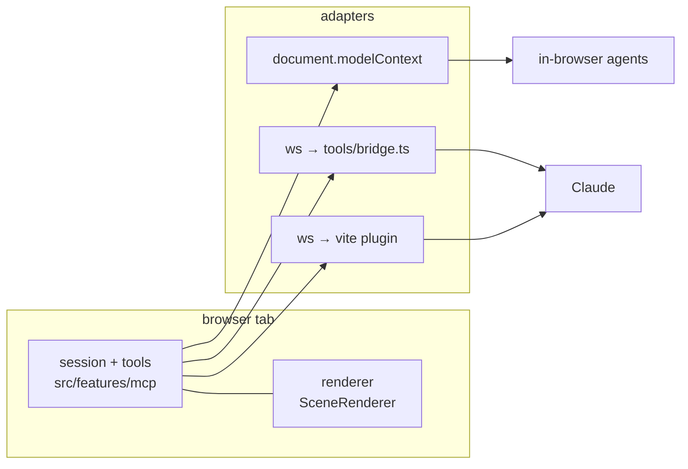

# MCP

A second channel into the document. A model builds through the same transactions a person does, so
it cannot produce an invalid model: every placement is solved by the mating code and validated
against the connection graph.

The tool layer runs **in the browser tab**. `src/model/` and `src/snap/` are pure — no three.js, no
DOM — so the session, the tools and the protocol handler are ordinary TypeScript that run in a page
and unit test under vitest. The tab also owns the only WebGL context, which is what makes
`model_screenshot` a camera move rather than a headless-render toolchain.

## Reaching the tab

A tab cannot listen. `new WebSocket(url)` dials outward and never creates an address, so something
already listening has to be dialled. Three adapters cover that, over one registry.



| Adapter | Reaches | Setup |
| --- | --- | --- |
| `bridge` | Any MCP client | `claude mcp add brickyard -- node tools/bridge.ts`, then paste the pairing token into the page |
| `vite` | A client on the same machine | `npm run dev`; the endpoint is announced at startup and `.mcp.json` offers it automatically |
| `webmcp` | Agents running inside the browser | None — the page registers its tools on load |

### Declaration

Tools are registered with `document.modelContext.registerTool()`, the
[W3C WebMCP](https://github.com/webmachinelearning/webmcp) surface, through
[`@mcp-b/webmcp-polyfill`](https://www.npmjs.com/package/@mcp-b/webmcp-polyfill) so the page does not
depend on native support. `getTools()` and `executeTool()` are consumer-side APIs available only to
agents inside the browser, so the socket adapters read the page's own registry instead.

### Bridge

`tools/bridge.ts` is a stdio MCP server that listens on localhost. It mints a single-use pairing
token; the page dials it and receives a session token scoped to one origin. The bridge binds to
loopback only, expires idle sessions, and holds one tab per session. The page shows the connection
state and offers a disconnect, because the pairing token is a capability: whoever holds it drives
that tab.

## Tools

Built to the [guidance for writing tools for agents](https://www.anthropic.com/engineering/writing-tools-for-agents):
a few tools over whole workflows rather than one per `Operation`. The operations in `docs/SPEC.md` are
what a person performs with a mouse; a model works in batches and wants fewer, larger tools.

| Tool | Workflow |
| --- | --- |
| `brick_place` | Place one or many bricks in a single call, each on a named connection point |
| `brick_transform` | Move, rotate or mirror a set, with the connectivity changes it implies |
| `brick_recolor` | Recolour a set, by handle or by group |
| `brick_remove` | Delete a set |
| `model_inspect` | The graph: model summary, one brick's detail, free points, neighbours, component, edges between a pair |
| `model_find` | Locate bricks by part, colour, group or region |
| `model_group` | Create, rename, set members, ungroup, list the tree |
| `model_screenshot` | Render from a named view or an explicit angle; returns an image |
| `model_history` | Undo, redo |
| `model_save` | Persist the document, or export `.ldr` |
| `parts_search` | The chest catalog by title and category |

**Placement names a target, not a matrix.** `brick_place` takes a target brick and connection point;
the session runs `findMates` and the collision check and derives the transform. A caller-supplied
`Mat4` would be an unconstrained 4×4 and the validity guarantee would not hold, so free placement is
a flag on the same tool and is still collision-checked. Cursor-driven scoring in `src/snap/resolve.ts`
answers a different question — which candidate a person meant — and is not involved.

**Handles, not ids.** `BrickId` is twelve characters from a 64-character alphabet, which is the
opaque-identifier case that costs agent accuracy. The session keeps a stable, legible handle per
brick and maps it to the `BrickId` internally. Ids surface only on request.

**Responses are bounded.** `model_inspect` and `model_find` return summaries by default, take a
`response_format` of `concise` or `detailed`, and truncate with a note naming a narrower query. A
large model is a few thousand bricks and must not fill a context window.

**Failures explain.** A rejected placement reports what was wrong — no compatible point on that face,
collision with a named brick, unknown part — and what to try instead.

Hide, isolate and selection are view state rather than document state, and are not exposed.

## Guidance the server carries

The server ships its own methodology: `instructions` in the `initialize` result, a `build` prompt, and
tool descriptions written as if for a new colleague.

Rendering a subject in brick is a creative problem, and a few decisions determine everything after
them. The guidance names those decisions rather than prescribing a procedure:

- **Scale, first and hardest.** The same subject is a different model at every size — at minifig scale
  a feature is a sub-assembly, at microscale a single part. Fix footprint and height in studs before
  anything else.
- **What has to read.** Three or four features make a subject recognisable. At small scale only the
  silhouette survives.
- **Which way the studs face.** Smooth and angled surfaces mean sideways building, which the
  connection model supports directly.
- **A small parts vocabulary.** Choose a handful of parts and reuse them, the way published sets do.
- **Check as you go.** A build that has drifted is easier to fix at fifty bricks than four hundred.

## Reference corpus

Published models carry `0 STEP`, so they arrive segmented into build steps by their authors. Running
connectivity extraction per step turns each into a graph delta — the bricks added and the edges they
formed — which is idiomatic construction expressed in the same representation the tools speak.
`reference_lookup` queries it: how published models attach a wing, build a hinge, turn a surface
sideways.

Mining frequent subgraphs across the corpus is the next step and belongs with the
symmetry work in `ROADMAP.md`.

## Layout

```
src/features/mcp/
  session.ts        document + history, applies transactions, answers queries
  handles.ts        legible brick handles ⇄ BrickId
  tools.ts          schemas and handlers — the registry
  protocol.ts       JSON-RPC: initialize, tools/*, prompts/*, ping
  instructions.ts   server instructions and the build prompt
  reference.ts      queries over the step-decomposed corpus
  webmcp.ts         registers the registry into document.modelContext
  bridgeClient.ts   dials a socket adapter, pairs, reconnects
src/scene/mcpView.ts    screenshot service over SceneCamera and SceneRenderer
src/ui/Connect/         pairing and connection state
src/model/serialize.ts  lossless JSON, and .ldr export
tools/bridge.ts         stdio MCP server and localhost listener
tools/vite-plugin-mcp.ts    dev-server adapter
```

`src/features/mcp/` is pure, like `src/model/` and `src/snap/`, and is tested the same way. The
session owns its own document; when the application's store lands, the session adopts it.

Serialization carries two formats because `.ldr` holds neither ids, groups nor the graph. The JSON
form is lossless and is what the tools save; `.ldr` is for interop, and a round trip through it mints
fresh ids.

## Verification

```bash
npm run test
npm run build     # the bridge and the SDK stay out of the browser bundle
```

End to end: start the dev server, connect, and ask for a small build. The checks that matter are that
a colliding placement is refused with a reason rather than an error, that free points shrink as studs
are built on, that a connected component returns the whole structure from any brick in it, and that
groups survive a save and reload.
