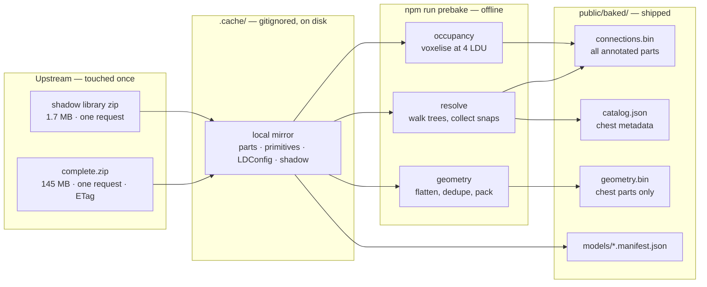
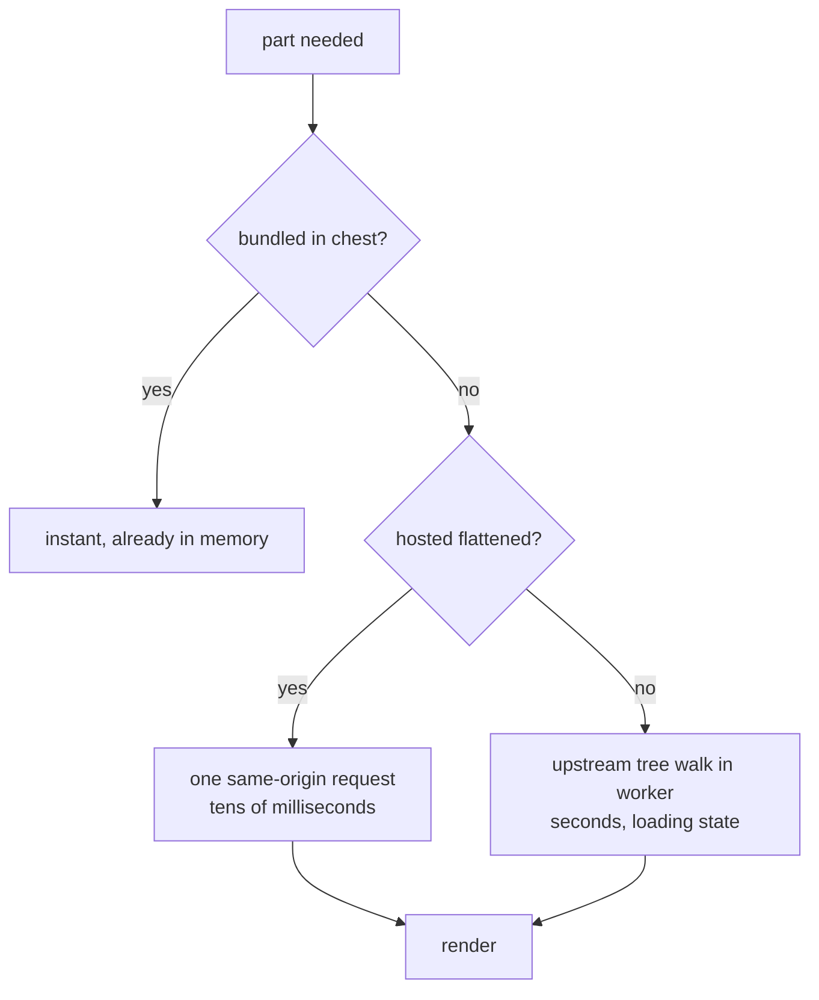

# Prebake pipeline

Resolving one part cold costs roughly 20 network requests and several seconds, and a small published
model uses ~53 unique parts. Baking is not an optimisation, it is the load path.



## Upstream politeness

**We mirror in bulk, once.** The full parts library is a single 145 MB zip and the shadow library a
single 1.7 MB zip. Fetching them individually would mean tens of thousands of requests against
volunteer-run infrastructure for exactly the same bytes.

Rules for `tools/sync-mirror.mjs`:

- Bulk archives only. Never crawl the file APIs to build a mirror.
- Store `ETag` and `Last-Modified`; subsequent syncs send `If-None-Match` and stop at `304`.
- The mirror lives in `.cache/ldraw/`, which is gitignored and never deleted by the bake step.
- `npm run prebake` reads the mirror and **makes no network requests at all**. Re-baking a hundred
  times costs upstream nothing.
- Sync is a separate, explicit command. It is not run automatically by `dev`, `build`, or `test`.

```bash
npm run sync-mirror     # one conditional request per archive; usually a 304
npm run prebake         # fully offline
```

## Bundled, hosted, fetched

Three tiers, and the distinction between the first two matters:

| Tier | Delivered | Size ceiling | Contents |
| --- | --- | --- | --- |
| **Bundled** | to every visitor on load | a few MB | chest geometry, all connection data, catalog |
| **Hosted** | on demand, same origin | ~1 GB site limit | flattened geometry for the covered corpus |
| **Fetched** | on demand, upstream | none | the long tail, via worker tree-walk |

Bundling is what every visitor downloads, so it must stay small. **Hosting is not bundling** — a file
served on demand from our own origin costs nothing to visitors who never request it. GitHub Pages
allows a 1 GB published site and 100 GB of monthly bandwidth, which is far more than we need.

So we host pre-flattened, single-file geometry for the ~4,200 parts the shadow library covers — the
parts that actually appear in real models. One same-origin, HTTP/2, CDN-backed request per part,
instead of ~20 cross-origin requests walking a subfile tree against a rate-limited third-party host.
At an estimated ~17 KB per flattened part that is on the order of 70 MB, comfortably inside the
limit. The real number gets measured during the first full bake; if flattening proves larger than
estimated, the hosted set narrows to the most common parts rather than growing the deploy.

Deploy time is the binding constraint rather than storage — Pages times out at 10 minutes — so the
hosted set stays bounded and is only rebuilt when the mirror changes.

## What gets baked

### Connection data — the whole annotated corpus

Resolved `ConnectionPoint` sets for every part the shadow library covers (~4,200), packed binary:
orientation quantised to a quaternion, positions and radii as float32, section profiles
length-prefixed. Roughly 65 bytes per point, on the order of a few megabytes gzipped for the entire
corpus.

Shipping all of it means **snapping always works**, for any part in any model the user opens, with no
network round trip. This is the highest-value bake and the cheapest.

### Geometry — the curated chest only

Flattened, deduplicated, packed vertex and index buffers for the parts in the chest. Geometry is
where the bytes are; the full corpus is far too large to ship, so this tier is bounded deliberately.

The chest starts small during development — a few dozen parts — and grows to a curated popular set
before shipping. That is a bundle-size decision, not an upstream one.

### Model manifests

For each bundled model: the list of unique parts it needs, and its solved connection graph. This
turns model loading from a serial discovery chain into one parallel prefetch, and skips the graph
solve entirely.

## Runtime fallback

Any part not in the baked chest still works.



Connection data is bundled for the entire annotated corpus, so snapping is available immediately for
any covered part regardless of which geometry tier it falls into. Only geometry is lazy. A part
outside the shadow library entirely still loads and renders — it simply has no connection points and
is placed freely.

Fetched geometry is cached in memory for the session. The upstream path is a genuine fallback,
expected to be rare once the hosted tier exists, and it never blocks the frame.

## Licensing of baked output

Hosting and bundling means redistributing, so the bake outputs carry upstream terms rather than the
application's licence:

- Geometry derives from the LDraw parts library (**CC BY 2.0**) — attribution required.
- Connection data derives from the LDCad shadow library (**CC BY-SA 4.0**) — attribution **and
  share-alike**, so the baked connection files are themselves CC BY-SA 4.0.
- Model manifests derive from OMR models (**CC BY 4.0**).

The application code stays MIT. `public/baked/` ships a `LICENSE.txt` naming each upstream source and
its terms, and `README.md` carries the same attributions.

## Determinism

The bake is a pure function of the mirror contents. `tools/prebake.mjs` writes a manifest recording
the source library version, the shadow library commit, and a content hash of each output, so a stale
or partial bake is detectable rather than mysterious.

## Development loop

| Command | Network | Typical cost |
| --- | --- | --- |
| `npm run sync-mirror` | 2 conditional requests | seconds when unchanged |
| `npm run prebake` | none | seconds to minutes |
| `npm run dev` | none | instant |
| `npm run test` | none | fast |

Only the first command talks to anyone else's server, and only when something upstream has actually
changed.
