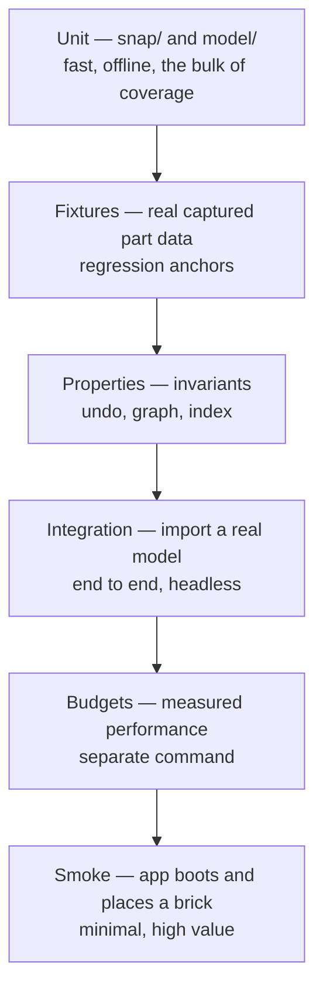

# Test plan

The correctness-critical parts of this project are pure functions over geometry and graphs, which is
convenient: the hardest logic is also the most testable. Effort concentrates there, and thins out
sharply toward the UI.

## Rules

**Tests never touch the network.** Part and shadow data used by tests is captured to disk and
committed. Fixtures live inside the slice that owns them — `src/snap/__fixtures__/`,
`src/ldraw/__fixtures__/` — so ownership boundaries hold. Cold-resolving one part costs ~20 requests;
a test suite that fetches is neither fast nor deterministic.

**Fixtures are real, never synthesised.** Geometry invented to make a test pass proves nothing about
a corpus of 18,000 parts. Captured `.dat` and shadow files only.

**Pure modules carry the coverage.** `snap/` and `model/` are held to a high bar. `scene/` and `ui/`
get smoke coverage; asserting on rendered pixels is expensive to maintain and rarely catches the bugs
that matter here.

## Unit tests

**`snap/`**
- Meta attribute parsing: `[key=value]` extraction, missing keys, case handling.
- `secs` parsing: single and multi-section profiles, all three variants (`R`, `S`, `A`).
- `grid` expansion: centred and uncentred on each axis, correct spacing and count.
- Transform accumulation down a reference chain, including backslash paths and subpart nesting.
- Reference resolution order (`parts/`, `p/`, `models/`) and 404 handling.
- Compatibility keys: opposite genders match, same genders do not, radius bucketing, axle-in-round
  rejection.
- `solveMating`: resulting transform places the moving point coincident and anti-parallel to the
  target; roll rotates about the shared axis only.
- `findMates`: an eight-stud coincidence is found for a squarely-stacked 2×4 pair.

**`model/`**
- `applyOperation` for every operation variant.
- `invertOperation` for every variant.
- Graph maintenance: adding a brick creates the expected edges and mates; removing it cleans both
  adjacency directions.
- `component` traversal across mixed polarity edges.
- Transaction undo and redo across multi-operation gestures.

**`ldraw/`**
- `LDConfig` color parsing: codes, alpha, material classes.
- Color `16` and `24` inheritance.

## Fixture tests

Captured parts, chosen because each one breaks a naive implementation:

| Fixture | Asserts |
| --- | --- |
| `3001` Brick 2×4 | 16 points: 8 male `R 6 4` at `y=0`, 8 female `R 6 20` at `y=24`. Grid expansion and primitive inheritance. |
| `4070` Headlight brick | A stud on `axis=[0,0,1]`. Sideways building; orientation is not an enum. |
| `3700` Technic Brick 1×2 with Hole | Stepped profile `R 8 2 · R 6 16 · R 8 2`. Multi-section matching. |
| `3818` Minifig arm | A point at `axis=[0,0.707,-0.707]`. Non-axis-aligned, fractional position. |
| `p/stud2.dat` open stud | Male and female from one primitive. |
| An uncovered part | Yields `connections: []` and still loads. |

These are exact-value assertions. If the shadow library or our parser changes behaviour, they fail
loudly, which is the point.

## Property tests

Invariants that should hold for any input:

- `invert(invert(op))` equals `op`.
- `apply(apply(doc, op), invert(op))` equals `doc`.
- Graph consistency: every edge appears in exactly two nodes' adjacency lists, and the sum of degrees
  is twice the edge count.
- Spatial index: a brick inserted is found by `near` within its radius; after `remove` it is not.
- Mating symmetry: if `solveMating(a, b)` places A against B, `findMates` on the result contains that
  pair.

## Integration

Headless import of a bundled model, asserting:

- Every referenced part resolves, or is explicitly reported as uncovered.
- Brick count and unique-part count match the file.
- Submodel transforms are applied (a model with a rotated submodel does not come back axis-aligned).
- The connection graph is non-empty and its largest component covers the expected share of bricks.
- Round trip: import, export `.ldr`, re-import, and get an equivalent document.

## Performance budgets

Run as `npm run test:perf`, separate from the main suite so that machine variance never blocks a
merge. Measured against a fixed synthetic scene and a fixed bundled model.

| Measurement | Budget |
| --- | --- |
| `resolveSnap` on a 5,000-brick scene | < 2 ms |
| Spatial index rebuild, 5,000 bricks | < 50 ms |
| Graph solve for a bundled model | reported, tracked for regression |
| Cached part instantiation | < 1 ms |

Budgets are asserted where the number is a real requirement, and merely reported where the value is
a tracking signal.

## Smoke

One Playwright spec, deliberately minimal:

- App boots, canvas is present, console has no errors.
- Selecting a part from the chest and clicking the baseplate adds exactly one brick.
- Undo removes it.

This catches integration breakage — a broken worker, a bad asset path, a build misconfiguration —
that unit tests structurally cannot.

## What is not tested automatically

Whether snapping picks the connection the user meant, whether motion reads well, and whether the tool
is pleasant to use. These are evaluated by hand. Automated tests protect them from regressing in
correctness, not in feel.
